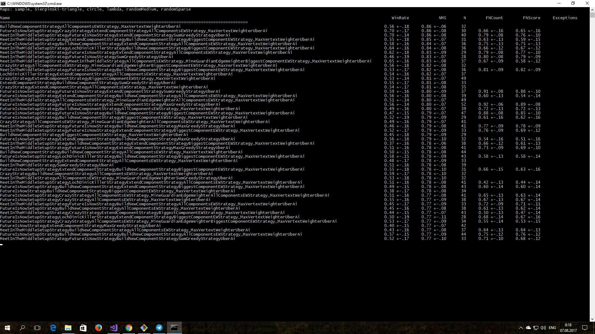

# ICFPC 2017. Team kontur.ru

There're 16 members in team kontur.ru and here's the code we've written.

## Code breakdown

Strategy:
* **[10+ strategies](lib/Strategies)** and 280 AIs based on these strategies, orchestrated by [UberfullessnessAi](lib/Ai/StrategicFizzBuzz/UberfullessnessAi.cs). See *Key ideas* below.
* **[20+ most powerful AIs](lib/Ai/)** that we hand-picked after the ultimate final tournament. See *Brutal Tester* below. 

Playing:
* **[Game Simulator](lib/Simulator).** A library which implements game rules according to [task specification](task) and enables our bots to interact.
* **[Punter](punter)**. A console app which uses our final AI to play matches offline. Connects to organizers' [Lambda Duct](https://icfpcontest2017.github.io/post/lambdaduct/) to play matches online. *This is the app we've submitted to organizers in the end of the contest.*
* **[Replay Collector](ReplayCollector).** A console app which plays our AIs against other bots on organizers' servers and saves replay data to Firebase.
* **[Worker](worker).** A task which plays matches online like *Replay Collector*, but is being run on a computing cluster (10 to 40 instances, up to 10 threads per instance).
* **[Foreman](foreman).** A console app which looks for matches on organizers' servers and assigns jobs to *Workers* via Apache Kafka.

Visualization:
* **[Visualizer](VizApp).** A GUI app which benchmarks our AIs against each other and visualizes their competition.
* **[Visualizer for Replays](VizReplaysApp).** A GUI app based on *Visualizer* which gets replay data from Firebase and visualizes matches played on organizers' servers.

Quality control:
* **[Brutal Tester](BrutalTesterAppOld).** A console app which massively benchmarks our AIs against each other and calculates statistics on win rates and turn durations. There's also a [version](BrutalTesterApp) which works with Apache Kafka and runs on a computing cluster.
* **[Data Science Stuff](python).** A number of [crazy-looking](python/HistoricalQualityControl.ipynb) Jupiter Notebooks to analyze matches between our bots and tune parameters for our strategies.

Monitoring:
* **[Online Game Monitor](OnlineGameMonitor).** A console app which displays live status of matches on organizers' servers, including matches being played by *Replay Collector*.
* **[Statistics Service](StatisticsService).** An API service which gets replay data from Firebase and provides it to *Online Statistics Monitor*.
* **[Online Statistics Monitor](icfpc2017-stats).** A web app which displays win rates for matches played on organizers' servers for each AI and map size.

Everything is written in C#, except for *Online Statistics Monitor* (JavaScript, HTML, CSS), *Data Science Stuff* (Python, Jupiter Notebook), and Ansible configs for Apache Kafka.

There're [ready-to-use binaries](_prebuild-binaries) for Brutal Tester, Visualizer, Visualizer for Replays, and Punter. Run them with `mono` on Mac/Linux or execute them on Windows.

## Key ideas

*Note. Have a look at the [task specification](tasks) to better understand our ideas.*

As one would expect from a team this large, we've conjured a *lot* of strategies. The most feasible ones are in `lib/Strategies`, including:

1. An algorithm that [extends a connected component](lib/Strategies/ExtendComponentStrategy.cs) of our rivers towards the closest reachable disconnected mine.
2. [A greedy algorithm](lib/Strategies/GreedyStrategy.cs) with a variety of different cost functions.
3. [An evil algorithm](lib/Strategies/LochDinicKillerStrategy.cs) that finds and takes over minimal cuts between mines, so that rivals can't connect them.
4. [A vicious algorithm](lib/Strategies/LochDinicKillerStrategy2.cs) that takes over all rivers that are directly connected to mines, so that weak unprepared rivals leave with nothing.
5. [An opening algorithm](lib/Strategies/FutureIsNowStrategy.cs) that calculates and connects safe but profitable futures with corresponding mines.
6. An algorithm that starts [new connected component](lib/Strategies/BuildNewComponentStrategy.cs) in the best place on the map.

Obviously, we needed a way to make these strategies work together, and a way to decide which strategy works best on different maps and at different stages of the game.

Our [final bot](lib/Ai/StrategicFizzBuzz/CompositeStrategicAi.cs) utilizes a priority list of strategies. That is, it selects and executes the best move (if any) of the highest priority strategy. Of course, a strategy can decide to do nothing and leave the decision to lower priority ones.

## Final submission

At around 2 hours before the end of the contest we've conducted a mass tournament between various combinations of our strategies on 4-player and 8-player maps.

Some of them had pretty good win rates, some failed miserably, but in the end this was our final submission:

1. If both *options* and *futures* are available:
	1. Select a path of length `~sqrt(N of sites)` that:
    — includes a lot of mines;
    — is highly connected (evaluated by calculating minimal cuts).
	2. Put as many *futures* as we can on this path, and put their targets as far away from mines as we can (but still on the chosen path).
	3. Try hard to connect all of these points (*futures* and corresponding mines) into one connected component.
	4. As soon as this happens or is no longer possible, continue by extending connected components towards the closest disconnected mine.
	5. As soon as all mines are connected into a single component or it is no longer possible, take other rivers greedily.
	6. Use *options* if necessary.

2. If there are either no *options* or no *futures* enabled:
	1. Start a connected component from a mine that is close to other mines.
	2. Extend this component towards the closest reachable disconnected mine.
	3. If this becomes impossible, start a new component from another mine that is close to other disconnected mines.
	4. As soon as all mines are connected into components or it is no longer possible, take other rivers greedily.

## Members

**Alexey Dubrovin [@Griboedoff](http://github.com/Griboedoff)**
* Runner code for *Game Simulator*.
* Improvements and fixes to *online protocol code*.
* Improvements to *Replay Collector*, creation of *Worker* and *Foreman* (with Alexey Kirpichnikov).

**Alexey Kirpichnikov [@beevee](http://github.com/beevee)**
* Message broker and workers ecosystem that helped with:  
  — strategy parameters analysis (with Yuri Okulovsky and Timofey Yefimov);  
  — playing a *lot* of online games (with Alexey Dubrovin and Igor Lukanin);  
  — ultimate final tournament between our strategies (with Andrew Kostousov and Ivan Dashkevich).
* Initial version of the *FutureIsNow* strategy (with Pavel Egorov).

**Alexey Kungurtsev [@KungA](http://github.com/KungA)**
* Shared code for distance, score, and maximum flow calculation in graph data structures.
* Work on strategies.

**Andrew Kostousov [@AndrewKostousov](http://github.com/AndrewKostousov)** and **Ivan Dashkevich [@spaceorc](http://github.com/spaceorc)**
* General API for AIs.
* Work on strategies.
* *Punter* with our final strategy.
* Lightning round and final submissions.

**Anton Tolstov [@anaym](http://github.com/anaym)**
* Improvements to *Visualizer*: futures, splurges, auto-replay.
* Improvements to *online protocol code*: support for splurges.
* Early version of *online protocol code*.

**Denis Ionov [@BadW0lf](http://github.com/BadW0lf)**
* *Game Simulator* to help us run our AIs and select the best ones.
* Improvements to *Visualizer* to provide a better understanding how AIs work in the real game.

**Grigory Ovchinnikov**
* Support for futures in the *online protocol code*.
* *Statistics Service* as a back-end for *Online Statistics Monitor*.

**Igor Lukanin [@igorlukanin](http://github.com/igorlukanin)**
* Initial version of *Replay Collector* which used *online protocol code* to play matches online and saved replays to Firebase.
* *Online Game Monitor* to watch dozens of our bots wandering around unpopulated organizers' servers (with Alexey Dubrovin).
* *Online Statistics Monitor* to know if our bots proved themselves during rare online matches (with Grigory Ovchinnikov).
* Improvements to *Brutal Tester* to measure turn durations and reassure teammates that our strategies are fast enough to pass (*pun intended*, with Pavel Egorov).

**Michael Khrushchev**
* Work on strategies.

**Michael Samoylenko [@SkyterX](http://github.com/SkyterX)**
* Some parts of the *Visualizer* to have fun and relax (with Pavel Egorov).
* Infrastructure for implementing bots via strategies to make it easier to implement new ideas and combine them with all the prior stuff.
* *MaxVertexWeight* strategy to make greedier decisions based on the far-reachable sites (with Pavel Ageev).

**Pavel Ageev**
* Some parts of *Visualizer*.
* Work on strategies.

**Pavel Egorov [@xoposhiy](http://github.com/xoposhiy)**
* *Visualizer* and *Visualizer for Replays* to help teammates procrastinate and maybe debug their strategies.
* Performance improvements to Firebase-related replays collection code.
* *FutureIsNow* strategy to exploit futures and gain ~5 % more scores (with Alexey Kirpichnikov).
* Support for *options* to force teammates to use them in their strategies (with Igor Lukanin).
* *Brutal Tester* to select the best strategy from hundreds of combinations during the last seconds of the contest.

**Stanislav Fedjanin [@BurningMarshmallow](http://github.com/BurningMarshmallow)**
* *[Online protocol code](lib/Interaction)* to interact with organizers' servers.

**Timofey Yefimov [@anotherbugmaster](http://github.com/anotherbugmaster)**
* Strategies parameters optimization, attempts to make a trainable AI.

**Yuri Okulovsky [@okulovsky](http://github.com/okulovsky)**
* Quality control using *Data Science Stuff*.

## Our apps during the contest

*Visualizer*:

*Brutal Tester* benchmarking dozens of strategies:

*Online Statistics Monitor* and *Online Game Monitor*, respectively:

